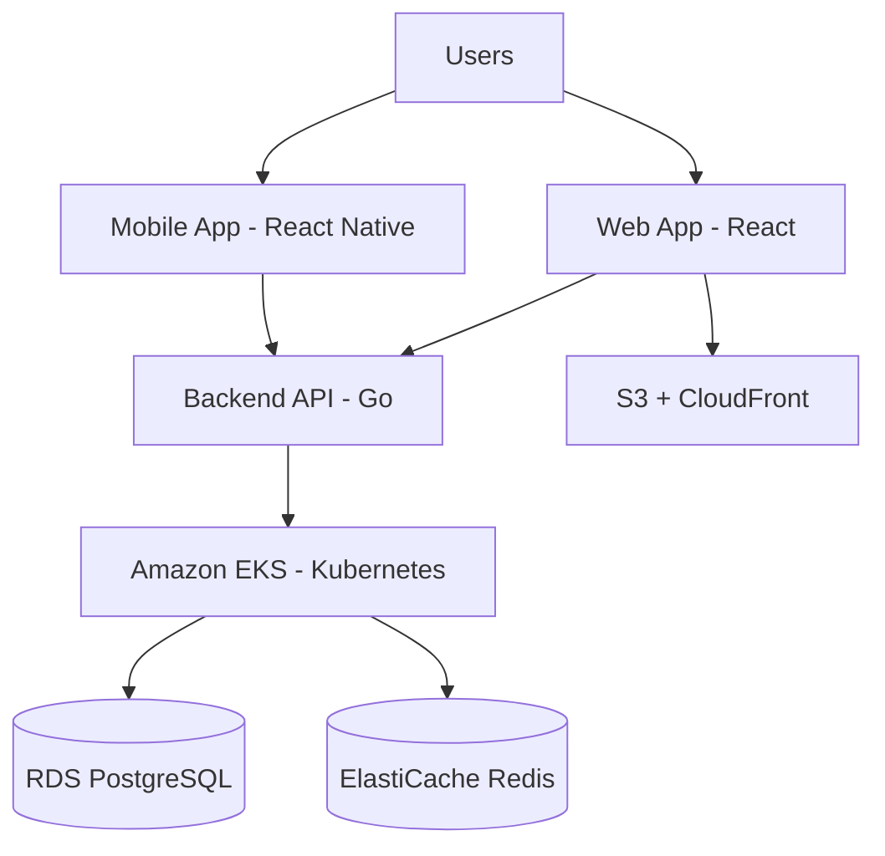

# Blockchain DApp Platform

[](https://github.com/your-org/Blockchain-DApp/actions)
[](https://github.com/your-org/Blockchain-DApp/actions)

A production-ready, multi-platform blockchain decentralized application (DApp) with comprehensive infrastructure automation, security scanning, and CI/CD pipelines.

## 🚀 Quick Start

### Prerequisites

- **Docker** 20.10+
- **Node.js** 18+
- **Go** 1.19+
- **Terraform** 1.5+
- **kubectl** 1.24+
- **AWS CLI** 2.0+
- **React Native CLI** (for mobile development)

### Local Development Setup

```bash
# Clone the repository
git clone https://github.com/your-org/Blockchain-DApp.git
cd Blockchain-DApp

# Run bootstrap script (sets up local environment)
./bootstrap.sh

# Start individual components
make app-dev      # Frontend web app
make backend-dev  # Backend API server
make mobile-dev   # Mobile app (requires iOS/Android setup)
```

For detailed setup instructions, see [Developer Setup Guide](docs/onboarding/dev-setup.md).

## 📋 Table of Contents

- [Architecture](#architecture)
- [Project Structure](#project-structure)
- [Components](#components)
- [Infrastructure](#infrastructure)
- [CI/CD Pipeline](#cicd-pipeline)
- [Documentation](#documentation)
- [Contributing](#contributing)
- [License](#license)

## 🏗️ Architecture

This platform consists of four main components:



**Key Technologies:**
- **Frontend**: React (Web), React Native (Mobile)
- **Backend**: Go 1.19
- **Infrastructure**: AWS (EKS, RDS, ElastiCache, S3, CloudFront)
- **IaC**: Terraform 1.5+
- **Container Orchestration**: Kubernetes on Amazon EKS
- **CI/CD**: GitHub Actions
- **Security**: Trivy scanning, AWS ECR image scanning

For detailed architecture documentation, see [System Overview](docs/architecture/system-overview.md).

## 📁 Project Structure

```
Blockchain-DApp/
├── app/                    # Frontend web application (React)
│   ├── src/               # Source code
│   ├── public/            # Static assets
│   ├── k8s/               # Kubernetes manifests
│   ├── dockerfile         # Docker configuration
│   └── package.json       # npm dependencies
│
├── backend/               # Backend API server (Go)
│   ├── cmd/              # Application entrypoints
│   ├── internal/         # Private application code
│   ├── api/              # API definitions
│   ├── k8s/              # Kubernetes manifests
│   ├── helm/             # Helm charts
│   └── dockerfile        # Docker configuration
│
├── mobile/               # Mobile application (React Native)
│   ├── src/             # Source code
│   ├── android/         # Android specific code
│   ├── ios/             # iOS specific code
│   └── app.json         # Expo/RN configuration
│
├── infra/               # Infrastructure as Code (Terraform)
│   ├── global/         # Account-level resources (CloudTrail, IAM, S3)
│   ├── env/            # Environment-specific configs (dev/staging/prod)
│   ├── modules/        # Reusable Terraform modules (EKS, VPC, RDS, Redis)
│   ├── ci-cd/          # GitHub Actions workflows
│   └── versions.tf     # Terraform version constraints
│
├── docs/               # Documentation
│   ├── architecture/  # System architecture docs
│   ├── onboarding/    # Developer guides
│   ├── runbooks/      # Operational procedures
│   └── compliance/    # Security & compliance docs
│
├── Makefile           # Common development commands
└── bootstrap.sh       # Environment setup script
```

## 🧩 Components

### Web Application (`app/`)

Modern React-based web interface hosted on AWS S3 with CloudFront CDN.

- **Tech Stack**: React, Node.js 18
- **Deployment**: S3 + CloudFront
- **CI/CD**: Automated build, test, and deployment on main branch

### Backend API (`backend/`)

RESTful API server built with Go, deployed on Kubernetes.

- **Tech Stack**: Go 1.19
- **Deployment**: Amazon EKS (Kubernetes)
- **Database**: RDS PostgreSQL
- **Cache**: ElastiCache Redis
- **Security**: Trivy vulnerability scanning, ECR image scanning

### Mobile App (`mobile/`)

Cross-platform mobile application for iOS and Android.

- **Tech Stack**: React Native
- **Platforms**: iOS, Android

## ☁️ Infrastructure

Infrastructure is managed using **Terraform** with a multi-environment setup:

### Environments

- **Dev**: Development environment for testing
- **Staging**: Pre-production environment
- **Prod**: Production environment

### Infrastructure Modules

| Module | Description |
|--------|-------------|
| **vpc** | Virtual Private Cloud with public/private subnets |
| **eks** | Amazon EKS Kubernetes cluster |
| **rds-postgres** | PostgreSQL database instances |
| **redis** | ElastiCache Redis clusters |
| **iam-roles** | IAM roles and policies |

### Deployment Order

1. **Global resources** (CloudTrail, IAM, S3) - deployed once
2. **Environment stacks** (dev → staging → prod)

```bash
# Deploy infrastructure
cd infra/env/dev
terraform init
terraform plan
terraform apply
```

See [Infrastructure Documentation](infra/README.md) for details.

## 🔄 CI/CD Pipeline

Automated pipelines powered by **GitHub Actions**:

### Workflows

| Workflow | Trigger | Purpose |
|----------|---------|----------|
| **Terraform CI** | PR/Push to `infra/**` | Run `terraform plan` for all environments |
| **Deploy Infrastructure** | Manual dispatch | Deploy infrastructure (global → dev → staging → prod) |
| **Deploy Application** | Push to `app/**` | Build, test, and deploy web app to S3/CloudFront |
| **Deploy Backend** | Push to `backend/**` | Build, scan, test, and deploy to EKS |

### Security Scanning

- **Trivy**: File system vulnerability scanning
- **AWS ECR**: Container image scanning
- **Results**: Uploaded to GitHub Security tab

### Secrets Required

- `AWS_ACCESS_KEY_ID`
- `AWS_SECRET_ACCESS_KEY`
- `S3_BUCKET_NAME`
- `CLOUDFRONT_DISTRIBUTION_ID`
- `EKS_CLUSTER_NAME`

## 📚 Documentation

Comprehensive documentation is available in the [`docs/`](docs/) directory:

- **[Architecture](docs/architecture/)** - System design, data flow, infrastructure diagrams
- **[Onboarding](docs/onboarding/)** - Developer setup guides
- **[Runbooks](docs/runbooks/)** - Operational procedures (incidents, rollbacks, scaling)
- **[Compliance](docs/compliance/)** - Security and compliance documentation

## 🛠️ Common Commands

```bash
# Infrastructure
make infra-plan ENV=dev        # Plan infrastructure changes
make infra-apply ENV=dev       # Apply infrastructure changes
make infra-destroy ENV=dev     # Destroy infrastructure

# Application Development
make app-install              # Install app dependencies
make app-dev                  # Run app in development mode
make app-build                # Build app for production
make app-test                 # Run app tests

# Backend Development
make backend-install          # Install Go dependencies
make backend-dev              # Run backend in development mode
make backend-build            # Build backend binary
make backend-test             # Run backend tests

# Mobile Development
make mobile-install           # Install mobile dependencies
make mobile-ios               # Run iOS simulator
make mobile-android           # Run Android emulator

# Docker
make docker-build-app         # Build app Docker image
make docker-build-backend     # Build backend Docker image
make docker-run-app           # Run app container
make docker-run-backend       # Run backend container
```

## 🤝 Contributing

We welcome contributions! Please follow these guidelines:

1. **Fork** the repository
2. **Create a feature branch**: `git checkout -b feature/amazing-feature`
3. **Commit your changes**: `git commit -m 'Add amazing feature'`
4. **Push to the branch**: `git push origin feature/amazing-feature`
5. **Open a Pull Request**

### Code Standards

- Follow existing code style and conventions
- Write tests for new features
- Update documentation as needed
- Ensure all CI checks pass

### Infrastructure Changes

- Always run `terraform plan` before `apply`
- Test changes in `dev` environment first
- Include plan output in PR description
- Never commit secrets or sensitive data

## 📄 License

This project is licensed under the MIT License - see the [LICENSE](LICENSE) file for details.

## 🆘 Support

- **Issues**: [GitHub Issues](https://github.com/your-org/Blockchain-DApp/issues)
- **Runbooks**: See [docs/runbooks](docs/runbooks/) for operational guides
- **Security**: Report security issues to security@your-org.com

## 🔗 Related Resources

- [AWS EKS Documentation](https://docs.aws.amazon.com/eks/)
- [Terraform AWS Provider](https://registry.terraform.io/providers/hashicorp/aws/latest/docs)
- [Kubernetes Documentation](https://kubernetes.io/docs/)
- [React Documentation](https://react.dev/)
- [Go Documentation](https://go.dev/doc/)

---

**Built with ❤️ using Terraform, Kubernetes, Go, and React**