# Data Flow Documentation

## Table of Contents

- [Overview](#overview)
- [User Request Flow](#user-request-flow)
- [Authentication Flow](#authentication-flow)
- [Blockchain Transaction Flow](#blockchain-transaction-flow)
- [Data Persistence Flow](#data-persistence-flow)
- [Caching Strategy](#caching-strategy)
- [Event-Driven Architecture](#event-driven-architecture)
- [Deployment Pipeline Flow](#deployment-pipeline-flow)

## Overview

This document describes how data flows through the Blockchain DApp Platform, from user interactions through the various layers of the application, infrastructure, and back to the user.

### Key Data Flow Patterns

1. **Synchronous Request-Response**: Web/Mobile → API → Database → Response
2. **Cached Responses**: API → Redis → Response (cache hit)
3. **Blockchain Interactions**: User → API → Blockchain Network → Confirmation
4. **Static Asset Delivery**: User → CloudFront → S3 → Content
5. **Event-Driven Processing**: Event → Queue → Worker → Processing

## User Request Flow

### Web Application Request Flow

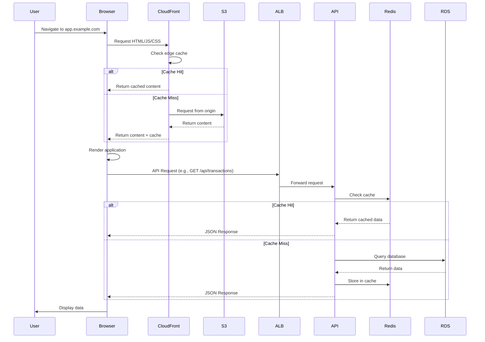

**Flow Steps**:

1. **User Request**: User navigates to web application URL
2. **DNS Resolution**: Domain resolves to CloudFront distribution
3. **Edge Caching**: CloudFront checks edge location cache
   - **Cache Hit**: Content served from edge location (fastest)
   - **Cache Miss**: Content fetched from S3, cached at edge
4. **Static Content Delivery**: HTML, JavaScript, CSS, images delivered
5. **App Initialization**: React app initializes in browser
6. **API Calls**: App makes API requests to backend
7. **Load Balancing**: ALB distributes requests across API pods
8. **Cache Check**: API checks Redis for cached response
9. **Database Query**: If cache miss, query PostgreSQL database
10. **Response Caching**: Fresh data cached in Redis with TTL
11. **Response**: JSON data returned to client
12. **Rendering**: Browser renders updated UI

### Mobile Application Request Flow

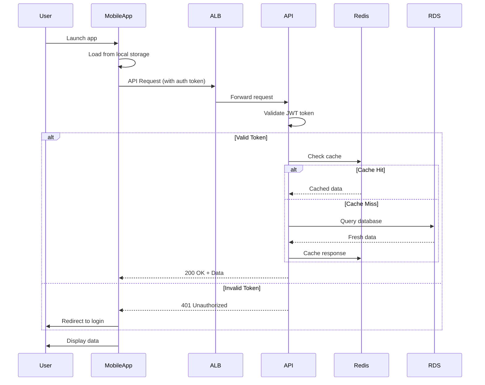

**Key Differences from Web**:
- No CloudFront/S3 layer (app bundle shipped with install)
- Always includes authentication token in requests
- May use local database (SQLite) for offline support
- Background sync when network available

## Authentication Flow

### User Login Flow

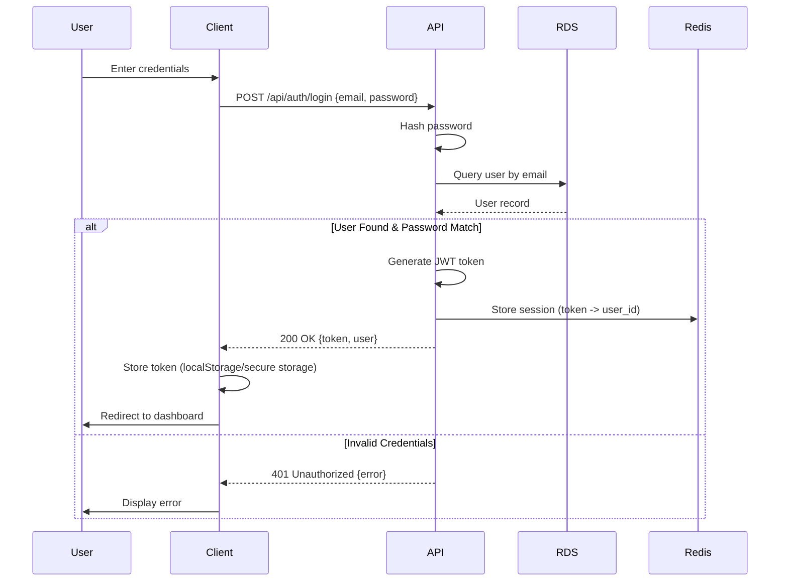

**Security Considerations**:
- Passwords hashed with bcrypt/argon2 (never stored in plaintext)
- JWT tokens signed with secret key
- Tokens have expiration time (e.g., 24 hours)
- Refresh token mechanism for long-lived sessions
- Session data cached in Redis for fast validation

### Authenticated Request Flow

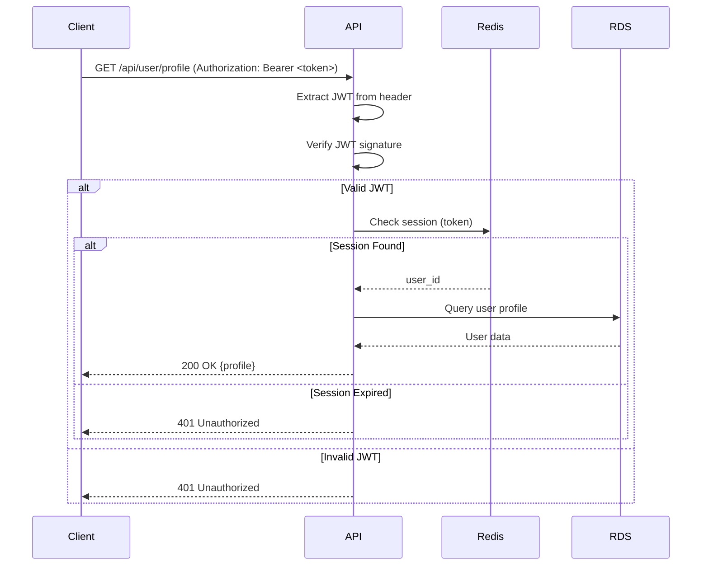

## Blockchain Transaction Flow

### Transaction Submission Flow

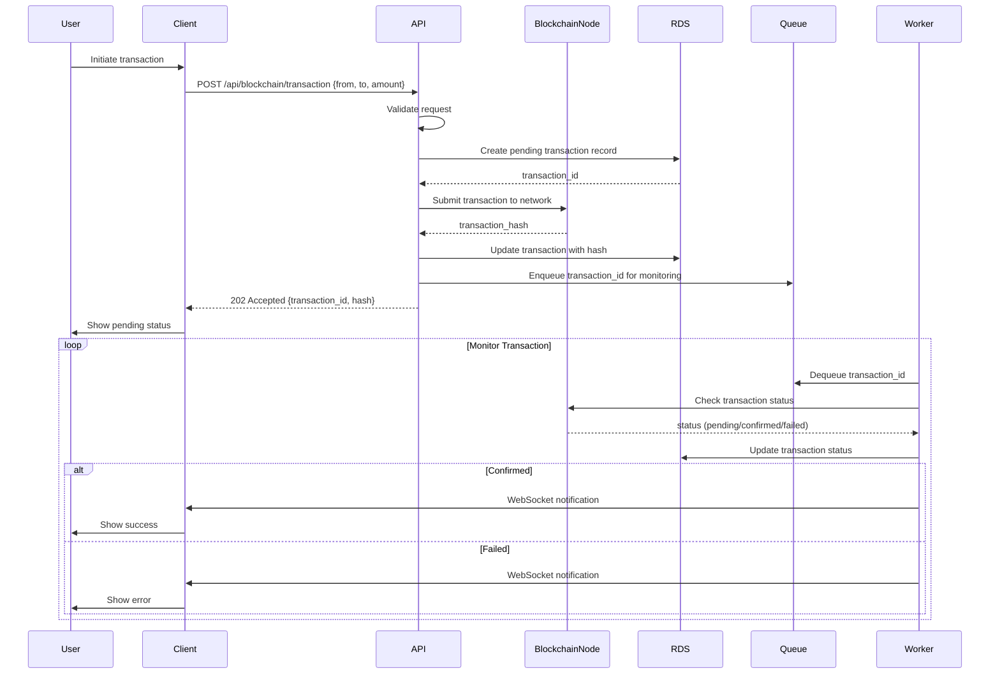

**Key Components**:

1. **Transaction Validation**: API validates transaction parameters
2. **Database Record**: Transaction saved as "pending" immediately
3. **Blockchain Submission**: Transaction submitted to blockchain network
4. **Async Monitoring**: Worker polls blockchain for confirmation
5. **Status Updates**: Database updated as transaction progresses
6. **User Notification**: Real-time updates via WebSocket or polling

### Transaction Confirmation Flow

**States**:
1. **Pending**: Submitted to network, awaiting confirmation
2. **Confirmed**: Included in block, waiting for confirmations
3. **Finalized**: Required confirmations met (e.g., 6 blocks)
4. **Failed**: Transaction rejected or expired

## Data Persistence Flow

### Write Operation Flow

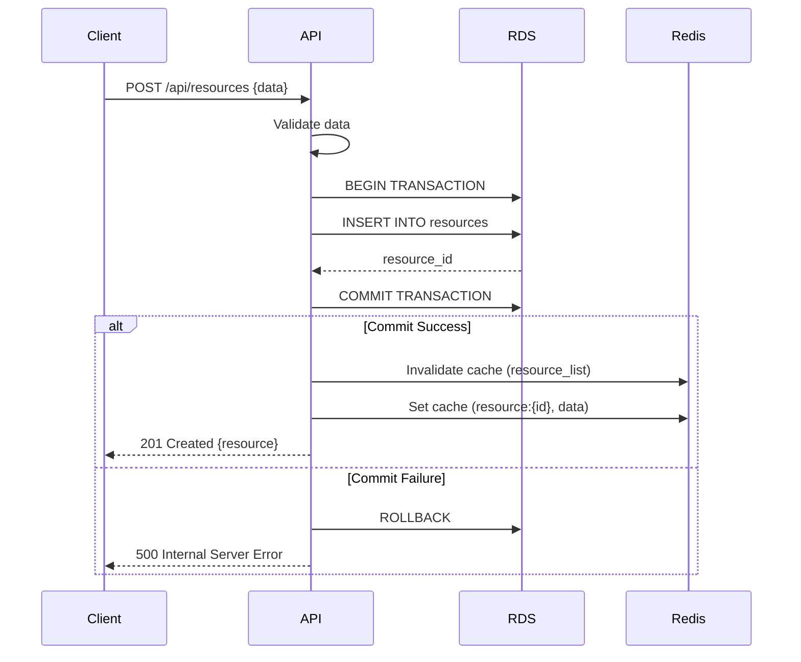

**Database Best Practices**:
- Use transactions for data consistency
- Invalidate related caches on writes
- Set cache for newly created resource
- Return created resource to client

### Read Operation Flow (Cache-Aside Pattern)

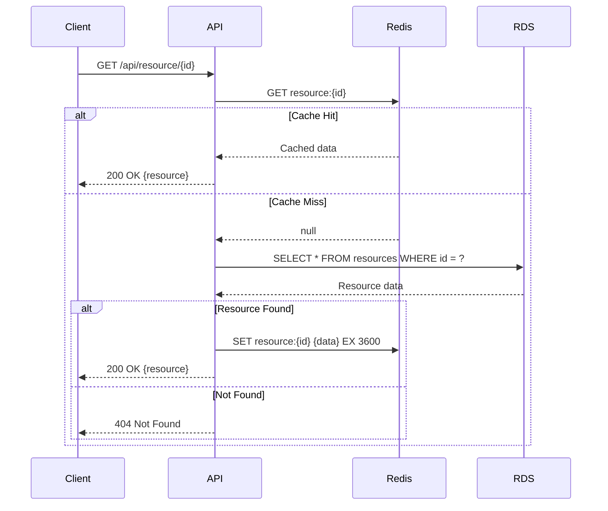

## Caching Strategy

### Cache Levels

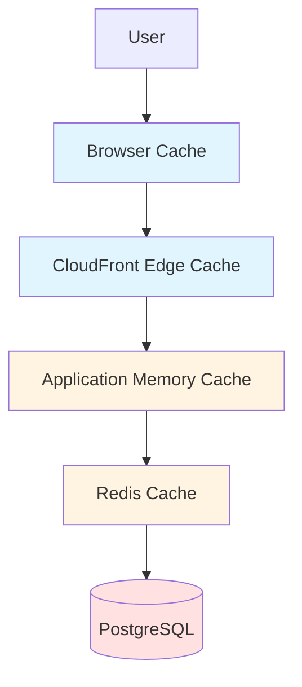

### Cache TTL Strategy

| Data Type | TTL | Invalidation Strategy |
|-----------|-----|----------------------|
| **Static Assets** (JS/CSS) | 1 year | Cache busting with file hash |
| **HTML** | 5 minutes | CloudFront invalidation on deploy |
| **API List Endpoints** | 5 minutes | Invalidate on CREATE/UPDATE/DELETE |
| **API Detail Endpoints** | 1 hour | Invalidate on UPDATE/DELETE |
| **User Sessions** | 24 hours | Invalidate on logout |
| **Blockchain Data** | 1 minute | Invalidate on new block |

### Cache Invalidation Patterns

**1. Time-based (TTL)**:
```
SET resource:123 {data} EX 3600  # Expires in 1 hour
```

**2. Event-based**:
```
# On resource update
DEL resource:123
DEL resource_list:page:1
```

**3. Tag-based** (Future):
```
# Tag resources
SET resource:123 {data}
SADD tag:user:456 resource:123

# Invalidate all resources for user
SMEMBERS tag:user:456  # Get all keys
DEL resource:123 resource:124...  # Delete all
```

## Event-Driven Architecture

### Message Queue Flow (Future Enhancement)

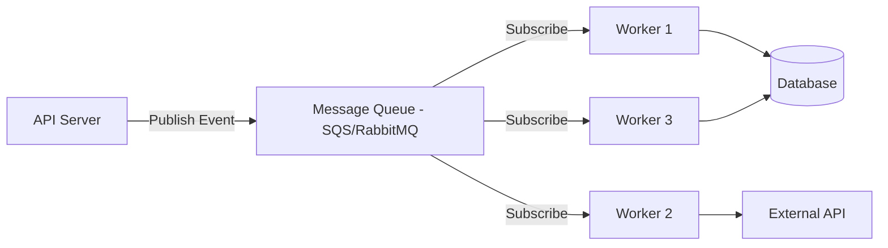

**Use Cases**:
- Email notifications (async)
- Transaction monitoring
- Report generation
- Blockchain event indexing
- Webhook deliveries

## Deployment Pipeline Flow

### Infrastructure Deployment Flow

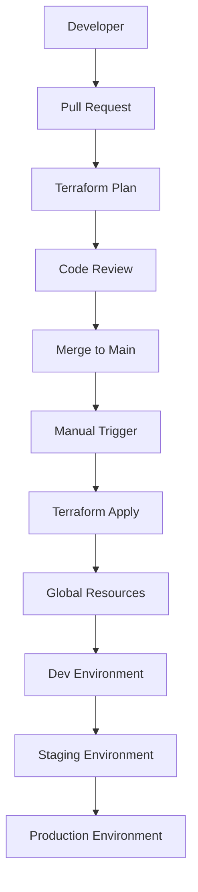

### Application Deployment Flow

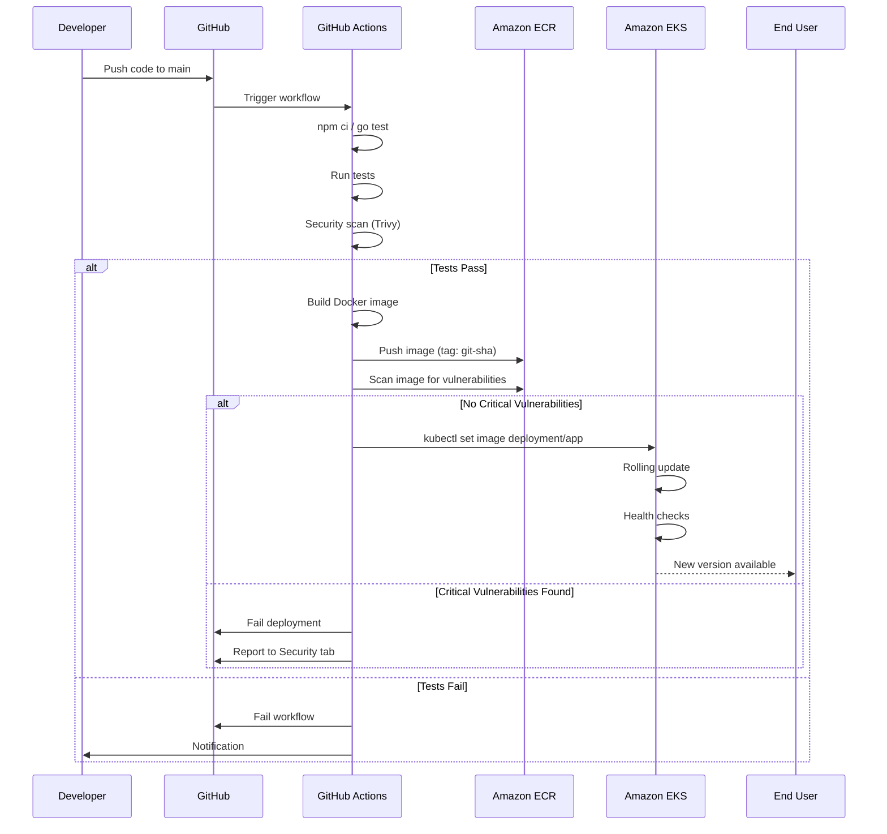

**Key Stages**:
1. **Code Commit**: Developer pushes to repository
2. **Build**: Install dependencies and compile
3. **Test**: Run unit and integration tests
4. **Security Scan**: Trivy scans for vulnerabilities
5. **Containerize**: Build Docker image
6. **Registry**: Push to ECR with git SHA tag
7. **Image Scan**: ECR scans image for CVEs
8. **Deploy**: Update Kubernetes deployment
9. **Rollout**: Rolling update with health checks
10. **Verify**: Post-deployment verification

## Data Backup and Recovery Flow

### Backup Flow

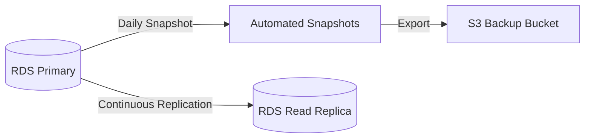

**Backup Strategy**:
- **Automated Snapshots**: Daily at 3 AM UTC, 7-day retention
- **Manual Snapshots**: Before major changes (deployments, migrations)
- **Read Replicas**: Continuous replication for read scaling and failover
- **Point-in-Time Recovery**: Up to 35 days

### Recovery Flow

**Scenario 1: Data Corruption (Point-in-Time Recovery)**
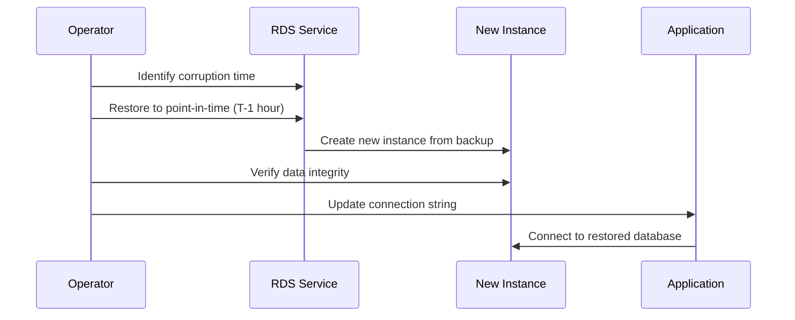

**Scenario 2: Complete Failure (Snapshot Restore)**
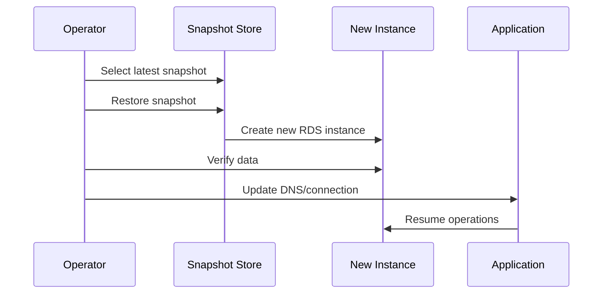

## Monitoring Data Flow

### Metrics Collection (Future)

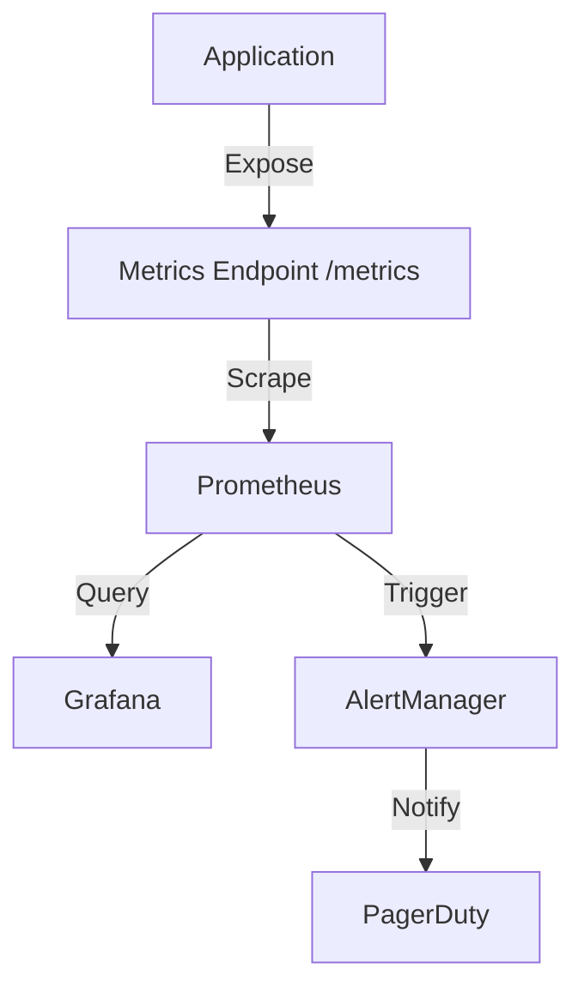

### Log Aggregation (Future)

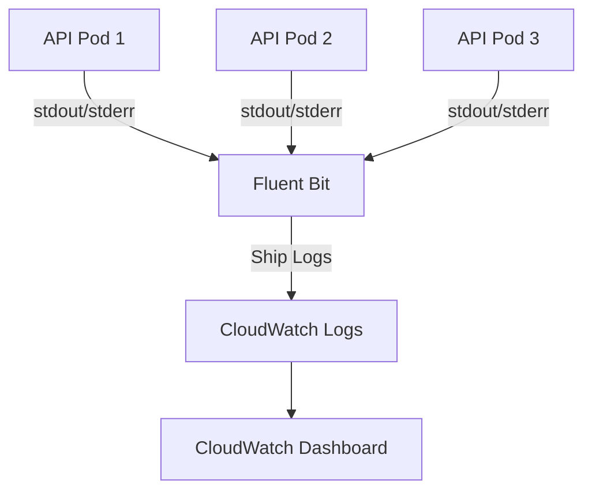

## Summary

Key data flow patterns in the Blockchain DApp Platform:

1. **Static Content**: CloudFront → S3 (cached at edge)
2. **API Requests**: Client → ALB → API → Cache/DB
3. **Authentication**: JWT-based with Redis session store
4. **Blockchain**: Async submission with worker monitoring
5. **Caching**: Multi-level (browser, CDN, Redis)
6. **Persistence**: Transactional writes, cached reads
7. **Deployment**: Automated CI/CD with security scanning
8. **Backups**: Automated daily snapshots with PITR

For operational procedures, see:
- [Incident Response Runbook](../runbooks/incident-response.md)
- [Rollback Procedure](../runbooks/rollback-procedure.md)
- [Scaling Guide](../runbooks/scaling-guide.md)