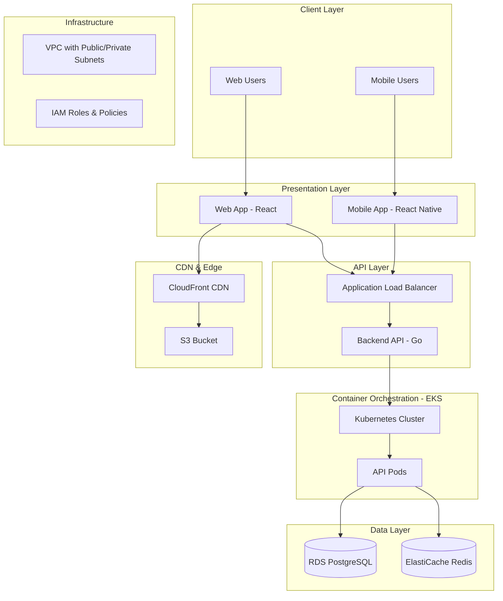
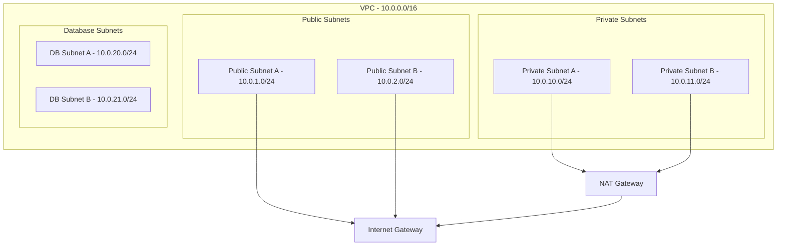

# System Overview

## Table of Contents

- [Introduction](#introduction)
- [High-Level Architecture](#high-level-architecture)
- [Component Overview](#component-overview)
- [Technology Stack](#technology-stack)
- [Infrastructure Architecture](#infrastructure-architecture)
- [Security Architecture](#security-architecture)
- [Scalability and Performance](#scalability-and-performance)
- [Deployment Architecture](#deployment-architecture)

## Introduction

The Blockchain DApp Platform is a production-grade, multi-tier decentralized application designed for high availability, scalability, and security. The system leverages modern cloud-native technologies and infrastructure-as-code practices to deliver a robust blockchain application across web and mobile platforms.

### Key Characteristics

- **Multi-platform**: Web (React), Mobile (iOS/Android via React Native)
- **Cloud-native**: Containerized applications running on Kubernetes (Amazon EKS)
- **Infrastructure-as-Code**: Fully automated infrastructure provisioning with Terraform
- **Security-first**: Automated vulnerability scanning, image scanning, and compliance monitoring
- **Multi-environment**: Separate dev, staging, and production environments
- **CI/CD Automated**: Full deployment automation with GitHub Actions

## High-Level Architecture



## Component Overview

### 1. Web Application (`app/`)

**Purpose**: Browser-based user interface for the blockchain DApp

**Technology**: 
- React (JavaScript framework)
- Node.js 18 (build tooling)
- Docker (containerization)

**Hosting**:
- Static assets served from S3
- Distributed globally via CloudFront CDN
- Automated deployment on code changes

**Key Features**:
- Server-side rendering capable
- Progressive Web App (PWA) ready
- Optimized bundle sizes
- Automated CI/CD pipeline

**Deployment Flow**:
1. Code pushed to `app/**`
2. GitHub Actions triggers build
3. `npm ci` installs dependencies
4. `npm test` runs test suite
5. `npm run build` creates production bundle
6. Assets synced to S3
7. CloudFront cache invalidated

### 2. Backend API (`backend/`)

**Purpose**: RESTful API server handling business logic and blockchain interactions

**Technology**:
- Go 1.19 (programming language)
- Docker (containerization)
- Kubernetes (orchestration)
- Helm (package management)

**Deployment**:
- Container images stored in Amazon ECR
- Deployed to Amazon EKS (Kubernetes)
- Horizontal Pod Autoscaling enabled
- Rolling update deployment strategy

**Key Features**:
- High-performance Go runtime
- Concurrent request handling
- Connection pooling to databases
- Graceful shutdown support
- Health check endpoints (`/health`, `/ready`)

**Security**:
- Trivy vulnerability scanning
- ECR automated image scanning
- Security findings reported to GitHub Security tab
- Non-root container execution

**Deployment Flow**:
1. Code pushed to `backend/**`
2. GitHub Actions triggers pipeline
3. `go test ./...` runs tests
4. `go build` compiles binary
5. Trivy scans filesystem for vulnerabilities
6. Docker image built and pushed to ECR
7. ECR scans image for CVEs
8. `kubectl set image` updates EKS deployment

### 3. Mobile Application (`mobile/`)

**Purpose**: Native mobile experience for iOS and Android

**Technology**:
- React Native (cross-platform framework)
- Expo (tooling and services)
- Native modules for platform-specific features

**Platforms**:
- iOS (via Xcode)
- Android (via Android Studio)

**Key Features**:
- Shared codebase (95%+ code reuse)
- Native performance
- Platform-specific UI adaptations
- Offline-first capabilities

## Technology Stack

### Frontend

| Component | Technology | Version |
|-----------|------------|----------|
| Web Framework | React | Latest |
| Mobile Framework | React Native | Latest |
| Runtime | Node.js | 18+ |
| Package Manager | npm | 8+ |
| Build Tool | Webpack/Vite | Latest |

### Backend

| Component | Technology | Version |
|-----------|------------|----------|
| Language | Go | 1.19 |
| Web Framework | (TBD) | - |
| ORM | (TBD) | - |
| Container Runtime | Docker | 20.10+ |

### Infrastructure

| Component | Technology | Version |
|-----------|------------|----------|
| Cloud Provider | AWS | - |
| IaC Tool | Terraform | 1.5+ |
| Container Orchestration | Kubernetes (EKS) | 1.24+ |
| Database | PostgreSQL (RDS) | 14+ |
| Cache | Redis (ElastiCache) | 7+ |
| CDN | CloudFront | - |
| Storage | S3 | - |
| Load Balancer | Application Load Balancer | - |

### CI/CD

| Component | Technology |
|-----------|------------|
| CI/CD Platform | GitHub Actions |
| Security Scanning | Trivy |
| Image Registry | Amazon ECR |
| Package Manager | Helm |

## Infrastructure Architecture

### AWS Account Structure

- **Account ID**: 248982879830
- **Primary Region**: us-east-1
- **Multi-environment**: dev, staging, prod

### Network Architecture (VPC Module)



**Key Design Decisions**:
- Multi-AZ deployment for high availability
- Public subnets for ALB and NAT gateways
- Private subnets for EKS worker nodes
- Isolated database subnets
- NAT Gateway for outbound internet access from private subnets

### Kubernetes Architecture (EKS Module)

**Control Plane**:
- Managed by AWS (EKS)
- Multi-AZ deployment
- Automatic version upgrades available

**Worker Nodes**:
- Auto Scaling Groups
- Spread across multiple availability zones
- Instance types optimized for workload

**Namespaces**:
- `default`: Application workloads
- `kube-system`: Kubernetes system components
- `monitoring`: Observability stack (future)

**Key Resources**:
- Deployments: Application pods
- Services: Load balancing and service discovery
- ConfigMaps: Configuration data
- Secrets: Sensitive data (database credentials, API keys)
- Ingress: External access via ALB

### Data Persistence (RDS Module)

**Database**: Amazon RDS for PostgreSQL

**Configuration**:
- Multi-AZ deployment for high availability
- Automated backups (daily snapshots)
- Point-in-time recovery enabled
- Encryption at rest (AWS KMS)
- Encryption in transit (SSL/TLS)

**Backup Strategy**:
- Automated daily backups
- 7-day retention period (configurable)
- Manual snapshots before major changes

### Caching Layer (Redis Module)

**Cache**: Amazon ElastiCache for Redis

**Configuration**:
- Cluster mode enabled for scalability
- Multi-AZ with automatic failover
- Encryption at rest and in transit

**Use Cases**:
- Session management
- API response caching
- Rate limiting
- Pub/sub messaging

### Global Resources

**CloudTrail**:
- Audit logging for all AWS API calls
- Centralized log storage in S3
- Integration with CloudWatch

**IAM**:
- Least-privilege access policies
- Service roles for EKS, RDS, Lambda
- CI/CD user for GitHub Actions

**S3 Buckets**:
- Web application static assets
- Terraform state files (with versioning and encryption)
- CloudTrail logs
- Application logs and backups

## Security Architecture

### Defense in Depth

**Layer 1: Network Security**
- VPC isolation
- Security Groups (stateful firewall)
- Network ACLs (stateless firewall)
- Private subnets for sensitive resources

**Layer 2: Application Security**
- Trivy vulnerability scanning (pre-deployment)
- ECR image scanning (post-build)
- HTTPS/TLS everywhere
- Input validation and sanitization

**Layer 3: Data Security**
- Encryption at rest (RDS, Redis, S3)
- Encryption in transit (TLS 1.2+)
- Database connection encryption
- Secrets managed via Kubernetes Secrets or AWS Secrets Manager

**Layer 4: Identity and Access**
- IAM roles with least privilege
- Service accounts for Kubernetes pods
- No hardcoded credentials
- Rotate credentials regularly

**Layer 5: Monitoring and Auditing**
- CloudTrail for AWS API auditing
- Application logging
- Security findings in GitHub Security tab
- Incident response runbooks

### Compliance Considerations

- PCI-DSS compliance checklist (see [compliance docs](../compliance/pci-dss-checklist.md))
- SOC2 controls mapping (see [compliance docs](../compliance/soc2-notes.md))
- Data residency and sovereignty
- GDPR considerations for user data

## Scalability and Performance

### Horizontal Scaling

**Backend API**:
- Kubernetes Horizontal Pod Autoscaler (HPA)
- Auto-scale based on CPU/memory utilization
- Target: 70% CPU utilization
- Min replicas: 2, Max replicas: 10

**Database**:
- Read replicas for read-heavy workloads
- Connection pooling to optimize connections
- Query optimization and indexing

**Cache**:
- Redis cluster mode for distributed caching
- Automatic sharding

### Vertical Scaling

**EKS Worker Nodes**:
- Instance type flexibility
- Upgrade instance types as needed

**RDS**:
- Instance class upgrades with minimal downtime

### Performance Optimizations

**Frontend**:
- CloudFront CDN for global distribution
- Edge caching with configurable TTLs
- Gzip/Brotli compression
- Code splitting and lazy loading
- Image optimization

**Backend**:
- Go's efficient concurrency model
- Connection pooling (database, cache)
- Response caching in Redis
- Efficient database queries with proper indexing

**Database**:
- Query optimization
- Proper indexing strategy
- Partitioning for large tables
- Regular VACUUM and ANALYZE

## Deployment Architecture

### Environment Strategy

| Environment | Purpose | Deployment Trigger | Approval Required |
|-------------|---------|-------------------|-------------------|
| **dev** | Development and testing | Manual or auto on feature branch | No |
| **staging** | Pre-production validation | Manual dispatch | No |
| **prod** | Production workloads | Manual dispatch | Yes (GitHub Environment) |

### Deployment Flow

**Infrastructure**:
```
Global Resources (once)
  ↓
Dev Environment
  ↓
Staging Environment
  ↓
Production Environment (manual approval)
```

**Application/Backend**:
```
Code Push
  ↓
CI: Build + Test + Scan
  ↓
Build Docker Image
  ↓
Push to ECR
  ↓
Deploy to Target Environment
  ↓
Post-Deployment Verification
```

### Rollback Strategy

- **Kubernetes**: Rolling update with maxUnavailable=1, maxSurge=1
- **Previous image tags** retained in ECR for quick rollback
- **Database migrations**: Forward-compatible changes only
- **Feature flags**: Gradual rollout and instant disable

See [Rollback Procedure](../runbooks/rollback-procedure.md) for detailed steps.

### Blue-Green Deployment (Future)

- Duplicate environment setup
- Traffic switching via ALB target groups
- Zero-downtime deployments
- Easy rollback

### Disaster Recovery

**RTO (Recovery Time Objective)**: 1 hour
**RPO (Recovery Point Objective)**: 15 minutes

**Strategies**:
- Multi-AZ deployment (automatic failover)
- Automated backups with point-in-time recovery
- Infrastructure recreatable via Terraform
- Documented recovery procedures

## Monitoring and Observability (Future Enhancement)

**Planned Components**:
- **Metrics**: Prometheus + Grafana
- **Logging**: Fluentd/Fluent Bit + CloudWatch Logs
- **Tracing**: Jaeger or AWS X-Ray
- **Alerting**: PagerDuty or Opsgenie integration

**Key Metrics to Monitor**:
- Application: Request rate, error rate, latency (RED metrics)
- Infrastructure: CPU, memory, disk, network
- Database: Connections, query performance, replication lag
- Cache: Hit rate, evictions, memory usage

## Conclusion

The Blockchain DApp Platform architecture is designed for:

✅ **High Availability**: Multi-AZ deployments, automatic failover
✅ **Scalability**: Horizontal and vertical scaling capabilities
✅ **Security**: Defense in depth, encryption, vulnerability scanning
✅ **Automation**: Full CI/CD, infrastructure as code
✅ **Observability**: Comprehensive logging and monitoring (planned)
✅ **Maintainability**: Clear separation of concerns, modular design

For more details on specific components, see:
- [Data Flow Documentation](data-flow.md)
- [Infrastructure Diagrams](infra-diagram.drawio)
- [Developer Setup Guide](../onboarding/dev-setup.md)
- [Operational Runbooks](../runbooks/)