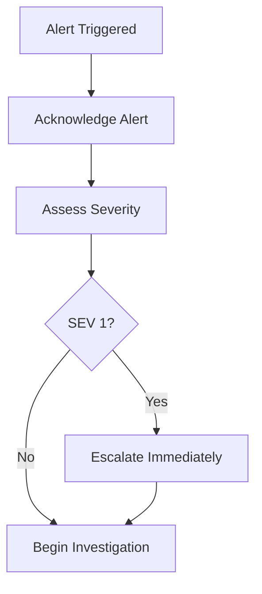

# Incident Response Runbook

## Table of Contents

- [Overview](#overview)
- [Incident Severity Levels](#incident-severity-levels)
- [Incident Response Team](#incident-response-team)
- [Response Process](#response-process)
- [Common Incident Scenarios](#common-incident-scenarios)
- [Communication Guidelines](#communication-guidelines)
- [Post-Incident Review](#post-incident-review)
- [Contact Information](#contact-information)

## Overview

This runbook provides step-by-step procedures for responding to production incidents in the Blockchain DApp Platform. Follow these guidelines to quickly identify, mitigate, and resolve issues while maintaining clear communication with stakeholders.

### Goals

1. **Minimize downtime** and impact to users
2. **Restore service** as quickly as possible
3. **Communicate effectively** with team and stakeholders
4. **Document learnings** for continuous improvement
5. **Prevent recurrence** through root cause analysis

## Incident Severity Levels

| Severity | Impact | Response Time | Examples |
|----------|--------|---------------|----------|
| **SEV 1 - Critical** | Complete service outage | Immediate | Entire application down, data breach, database corruption |
| **SEV 2 - High** | Major feature unavailable | 15 minutes | API errors >50%, payment processing down, authentication broken |
| **SEV 3 - Medium** | Degraded performance | 1 hour | High latency, intermittent errors <20%, non-critical feature down |
| **SEV 4 - Low** | Minor issue | 4 hours | UI glitches, cosmetic issues, single user reports |

## Incident Response Team

### Roles and Responsibilities

**Incident Commander (IC)**
- Leads incident response
- Makes final decisions
- Coordinates team activities
- Manages communication

**Technical Lead**
- Investigates root cause
- Implements technical fixes
- Coordinates with engineers

**Communications Lead**
- Updates status page
- Communicates with stakeholders
- Prepares customer notifications

**On-Call Engineer**
- First responder
- Initial investigation
- Escalates as needed

### On-Call Rotation

- **Primary**: First responder (15-minute SLA)
- **Secondary**: Backup if primary unavailable (30-minute SLA)
- **Escalation**: Team lead or manager

## Response Process

### Phase 1: Detection and Triage (0-5 minutes)



#### Steps

1. **Acknowledge the Alert**
   ```bash
   # In PagerDuty or alerting system
   - Click "Acknowledge"
   - Add initial note: "Investigating"
   ```

2. **Initial Assessment**
   - What is affected? (API, database, web app, mobile app)
   - How many users impacted? (check metrics)
   - When did it start? (check dashboards, logs)
   - Is this a known issue? (check recent deployments, previous incidents)

3. **Determine Severity**
   - Use the severity table above
   - When in doubt, escalate

4. **Escalate if SEV 1 or SEV 2**
   ```bash
   # Notify in Slack
   /incident declare "Brief description of issue" severity:critical
   
   # Call secondary on-call if needed
   # Page incident commander for SEV 1
   ```

### Phase 2: Investigation (5-15 minutes)

#### Quick Health Checks

**1. Check Application Health**
```bash
# Backend API health
curl https://api.yourdomain.com/health

# Expected: {"status": "healthy", "timestamp": "..."}
```

**2. Check Infrastructure**
```bash
# EKS cluster status
kubectl get nodes
kubectl get pods -A | grep -v Running

# Check pod logs
kubectl logs -n default deployment/blockchain-backend --tail=100
```

**3. Check Database**
```bash
# RDS status via AWS CLI
aws rds describe-db-instances --db-instance-identifier prod-postgres

# Check connections
psql -h <RDS_ENDPOINT> -U postgres -c "SELECT count(*) FROM pg_stat_activity;"
```

**4. Check Redis**
```bash
# Connect to Redis
redis-cli -h <ELASTICACHE_ENDPOINT>

# Check status
INFO
DBSIZE
```

**5. Review Recent Changes**
```bash
# Check recent deployments
kubectl rollout history deployment/blockchain-backend

# Check recent commits
git log --oneline -10

# Review recent infrastructure changes
cd infra/env/prod
terraform show
```

**6. Check Monitoring Dashboards**
- CloudWatch Dashboards (if configured)
- Grafana (if configured)
- Application metrics
- Error rates
- Response times

**7. Review Logs**
```bash
# Application logs
kubectl logs -f deployment/blockchain-backend --tail=200

# CloudWatch Logs
aws logs tail /aws/eks/prod/application --follow

# Search for errors
kubectl logs deployment/blockchain-backend | grep -i error
```

### Phase 3: Mitigation (15-30 minutes)

Goal: Stop the bleeding, restore service

#### Quick Mitigation Options

**Option 1: Rollback Deployment** (if recent deployment caused issue)
```bash
# See rollback-procedure.md for detailed steps
kubectl rollout undo deployment/blockchain-backend

# Verify rollback
kubectl rollout status deployment/blockchain-backend
```

**Option 2: Scale Resources**
```bash
# Scale up pods if resource exhaustion
kubectl scale deployment/blockchain-backend --replicas=10

# Scale up RDS (manual via AWS Console or CLI)
aws rds modify-db-instance --db-instance-identifier prod-postgres \
  --db-instance-class db.r6g.2xlarge --apply-immediately
```

**Option 3: Restart Services**
```bash
# Restart pods
kubectl rollout restart deployment/blockchain-backend

# Restart specific pod
kubectl delete pod <POD_NAME>
```

**Option 4: Enable Maintenance Mode**
```bash
# Update load balancer to show maintenance page
# (Implementation depends on your setup)
kubectl apply -f k8s/maintenance-mode.yaml
```

**Option 5: Disable Problematic Feature**
```bash
# Update feature flag in ConfigMap
kubectl edit configmap app-config

# OR update environment variable
kubectl set env deployment/blockchain-backend FEATURE_X_ENABLED=false
```

**Option 6: Clear Cache**
```bash
# Flush Redis cache if stale data is causing issues
redis-cli -h <ENDPOINT> FLUSHDB

# Or clear specific keys
redis-cli -h <ENDPOINT> DEL key_pattern*
```

### Phase 4: Communication (Ongoing)

#### Internal Communication

**Initial Update (within 5 minutes)**
```
[INCIDENT] SEV 2 - API Errors Elevated

Status: Investigating
Impact: Elevated error rate on API (15%)
Started: 2024-01-15 14:30 UTC
IC: @john.doe
Technical Lead: @jane.smith

Next update: 15 minutes
```

**Progress Updates (every 15-30 minutes)**
```
[UPDATE] SEV 2 - API Errors Elevated

Status: Mitigating
Actions Taken:
- Identified issue: Database connection pool exhausted
- Mitigation: Increased pool size from 20 to 50
- Monitoring: Error rate dropping from 15% to 8%

Next steps:
- Monitor for 10 minutes
- If stable, close incident

Next update: 15 minutes
```

#### External Communication

**Status Page Update** (for SEV 1 and SEV 2)
```
Title: API Service Degradation

We are currently experiencing elevated error rates on our API. 
Our team is actively investigating and working on a resolution.

Affected Services:
- API (Degraded Performance)

Updated: 2024-01-15 14:35 UTC
Next update: 15 minutes
```

**Customer Email** (for prolonged SEV 1 incidents)
```
Subject: Service Disruption Update

Dear Customers,

We experienced a service disruption today from 14:30 to 15:15 UTC. 
The issue has been resolved and all services are now operating normally.

Root Cause: Database connection pool exhaustion due to increased traffic
Resolution: Increased connection pool capacity and implemented auto-scaling

We apologize for any inconvenience. If you have questions, 
please contact support@yourdomain.com.

Best regards,
Blockchain DApp Team
```

### Phase 5: Resolution (30+ minutes)

1. **Verify Service Restored**
   ```bash
   # Check health endpoints
   curl https://api.yourdomain.com/health
   
   # Monitor metrics
   # - Error rate < 1%
   # - Response time < 200ms p95
   # - No alerts firing
   ```

2. **Monitor for Stability**
   - Watch metrics for 15-30 minutes
   - Ensure no regression
   - Check user reports

3. **Document Timeline**
   ```
   14:30 UTC - Alert triggered: High API error rate
   14:32 UTC - On-call acknowledged, began investigation
   14:35 UTC - Severity assessed as SEV 2
   14:40 UTC - Root cause identified: DB connection pool exhaustion
   14:45 UTC - Mitigation applied: Increased pool size
   14:50 UTC - Error rate normalized
   15:00 UTC - Monitoring for stability
   15:15 UTC - Incident resolved
   ```

4. **Update Status**
   ```
   [RESOLVED] SEV 2 - API Errors Elevated
   
   Status: Resolved
   Duration: 45 minutes
   Root Cause: Database connection pool exhaustion
   Resolution: Increased connection pool size and added monitoring
   
   Post-incident review scheduled for tomorrow at 10 AM.
   ```

## Common Incident Scenarios

### Scenario 1: Application Won't Start

**Symptoms**: Pods in CrashLoopBackOff

**Investigation**:
```bash
# Check pod status
kubectl get pods

# Check pod events
kubectl describe pod <POD_NAME>

# Check logs
kubectl logs <POD_NAME> --previous
```

**Common Causes**:
- Missing environment variables
- Database connection failures
- Image pull errors
- Health check failures

**Resolution**:
```bash
# Fix ConfigMap/Secret
kubectl edit configmap app-config

# Rollback to previous version
kubectl rollout undo deployment/blockchain-backend

# Update image pull secrets
kubectl create secret docker-registry regcred --docker-server=... 
```

### Scenario 2: Database Connection Issues

**Symptoms**: "Too many connections" errors

**Investigation**:
```sql
-- Check current connections
SELECT count(*) FROM pg_stat_activity;

-- Check connection limit
SHOW max_connections;

-- Identify long-running queries
SELECT pid, now() - query_start as duration, query 
FROM pg_stat_activity 
WHERE state != 'idle' 
ORDER BY duration DESC;
```

**Resolution**:
```bash
# Increase connection pool (application)
kubectl set env deployment/blockchain-backend DB_POOL_SIZE=50

# Increase max_connections (database)
aws rds modify-db-parameter-group \
  --db-parameter-group-name prod-postgres \
  --parameters "ParameterName=max_connections,ParameterValue=200,ApplyMethod=immediate"

# Restart stuck connections
# In psql:
SELECT pg_terminate_backend(pid) FROM pg_stat_activity WHERE state = 'idle in transaction';
```

### Scenario 3: High Memory/CPU Usage

**Symptoms**: Pods being OOMKilled, high CPU throttling

**Investigation**:
```bash
# Check resource usage
kubectl top pods
kubectl top nodes

# Check pod limits
kubectl describe pod <POD_NAME> | grep -A5 Limits
```

**Resolution**:
```bash
# Scale horizontally (add more pods)
kubectl scale deployment/blockchain-backend --replicas=10

# Update resource limits (edit deployment)
kubectl edit deployment blockchain-backend
# Increase resources.limits.memory and resources.limits.cpu

# Scale nodes (if all nodes full)
# Via AWS Console or eksctl
```

### Scenario 4: Elevated Error Rate

**Symptoms**: API returning 500 errors

**Investigation**:
```bash
# Check application logs
kubectl logs deployment/blockchain-backend | grep "ERROR"

# Check specific error types
kubectl logs deployment/blockchain-backend | grep "500" | head -20

# Check external dependencies (database, Redis, blockchain node)
```

**Resolution**:
- Rollback recent deployment
- Fix bug and deploy patch
- Increase timeouts if external dependency slow
- Enable circuit breaker if external service down

### Scenario 5: CloudFront/S3 Issues

**Symptoms**: Web app not loading

**Investigation**:
```bash
# Check CloudFront distribution
aws cloudfront get-distribution --id <DISTRIBUTION_ID>

# Check S3 bucket
aws s3 ls s3://<BUCKET_NAME>/

# Test direct S3 access
curl https://<BUCKET_NAME>.s3.amazonaws.com/index.html
```

**Resolution**:
```bash
# Invalidate CloudFront cache
aws cloudfront create-invalidation \
  --distribution-id <DISTRIBUTION_ID> \
  --paths "/*"

# Re-deploy frontend
cd app
npm run build
aws s3 sync dist/ s3://<BUCKET_NAME>/ --delete
```

## Communication Guidelines

### Communication Channels

| Channel | Use For |
|---------|--------|
| **Slack #incidents** | Real-time team coordination |
| **PagerDuty** | Alert acknowledgment and escalation |
| **Status Page** | Customer-facing updates |
| **Email** | Post-incident summaries to stakeholders |
| **Zoom/Call** | SEV 1 war room |

### Update Frequency

- **SEV 1**: Every 15 minutes
- **SEV 2**: Every 30 minutes
- **SEV 3**: Every hour
- **SEV 4**: As needed

### Tone and Style

- **Be clear and concise**: Avoid jargon for customer communications
- **Be factual**: Stick to what you know
- **Be honest**: If you don't know, say "investigating"
- **Be empathetic**: Acknowledge user impact

## Post-Incident Review

### Within 24 Hours

1. **Schedule PIR Meeting**
   - Invite all responders
   - Invite relevant stakeholders
   - 1-hour timebox

2. **Prepare PIR Document**

**Template**:
```markdown
# Post-Incident Review: [Incident Title]

## Incident Summary
- **Date**: 2024-01-15
- **Duration**: 45 minutes (14:30 - 15:15 UTC)
- **Severity**: SEV 2
- **Impact**: 15% of API requests returned errors

## Timeline
| Time (UTC) | Event |
|------------|-------|
| 14:30 | Alert triggered: High error rate |
| 14:32 | On-call acknowledged |
| ... | ... |

## Root Cause
Database connection pool was set to 20 connections. During peak traffic 
(3x normal), the pool was exhausted, causing API timeouts.

## What Went Well
- Quick detection via monitoring
- Fast response time (2 minutes)
- Clear communication

## What Went Wrong
- Connection pool sizing not tested under load
- No auto-scaling for connection pool
- Monitoring alert threshold too high

## Action Items
| Action | Owner | Due Date |
|--------|-------|----------|
| Implement auto-scaling for DB pool | @eng | 2024-01-20 |
| Add connection pool monitoring | @ops | 2024-01-18 |
| Load test with 5x traffic | @qa | 2024-01-25 |
| Update alert thresholds | @sre | 2024-01-17 |

## Lessons Learned
- Always load test connection pools
- Set alert thresholds based on user impact, not absolute values
- Document known capacity limits
```

3. **Follow Up on Action Items**
   - Track in Jira/GitHub Issues
   - Review in weekly team meeting
   - Mark as complete when done

## Contact Information

### On-Call Rotation

```bash
# Check current on-call
# Via PagerDuty API or web interface
```

### Escalation Path

1. **Primary On-Call** (15-minute SLA)
2. **Secondary On-Call** (30-minute SLA)
3. **Engineering Manager**
4. **CTO**

### External Contacts

- **AWS Support**: [AWS Console Support](https://console.aws.amazon.com/support/)
- **Third-party Services**: (List any critical third-party contacts)

## Appendix

### Useful Commands

```bash
# Quick health check script
#!/bin/bash
echo "=== API Health ==="
curl https://api.yourdomain.com/health

echo "\n=== Pods Status ==="
kubectl get pods -n default

echo "\n=== Recent Errors ==="
kubectl logs deployment/blockchain-backend --tail=50 | grep ERROR

echo "\n=== Resource Usage ==="
kubectl top pods -n default
```

### Related Runbooks

- [Rollback Procedure](rollback-procedure.md)
- [Scaling Guide](scaling-guide.md)
- [Developer Setup](../onboarding/dev-setup.md)

---

**Remember**: Stay calm, communicate clearly, and focus on restoring service first. Detailed investigation can come after mitigation.