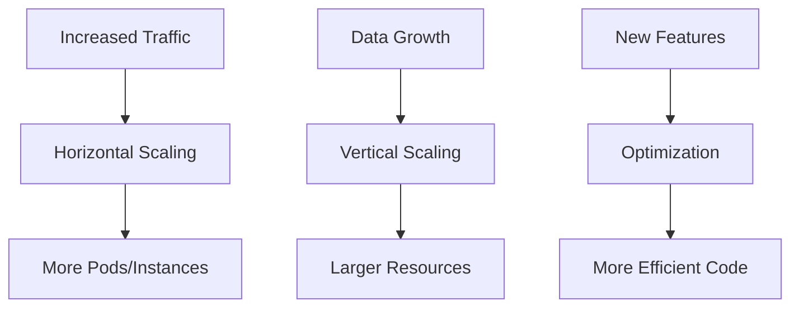
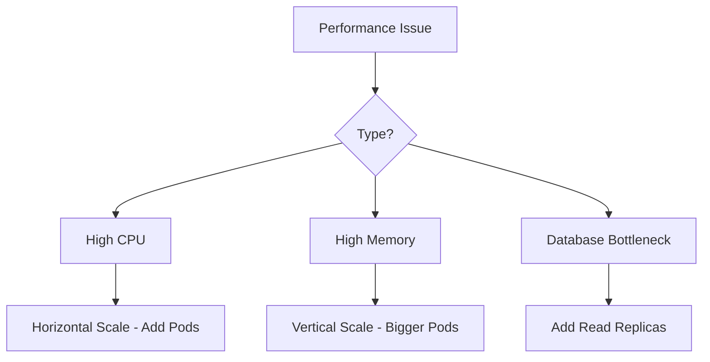

# Scaling Guide

## Table of Contents

- [Overview](#overview)
- [Scaling Strategies](#scaling-strategies)
- [Horizontal Scaling](#horizontal-scaling)
- [Vertical Scaling](#vertical-scaling)
- [Database Scaling](#database-scaling)
- [Cache Scaling](#cache-scaling)
- [Frontend Scaling](#frontend-scaling)
- [Cost Optimization](#cost-optimization)
- [Monitoring and Metrics](#monitoring-and-metrics)
- [Capacity Planning](#capacity-planning)

## Overview

This guide provides procedures for scaling the Blockchain DApp Platform to handle increased load, whether from traffic spikes, data growth, or new feature requirements.

### Scaling Dimensions



### When to Scale

| Metric | Threshold | Action |
|--------|-----------|--------|
| **CPU Usage** | >70% sustained | Scale horizontally or vertically |
| **Memory Usage** | >80% sustained | Scale vertically or optimize |
| **Response Time** | p95 >500ms | Investigate, then scale |
| **Error Rate** | >5% | Investigate, may need scaling |
| **Database Connections** | >80% of max | Increase pool size or add replicas |
| **Queue Depth** | Growing consistently | Add workers |

## Scaling Strategies

### Decision Matrix



### Scaling Priorities

1. **Optimize First**: Code improvements often more effective than scaling
2. **Horizontal Before Vertical**: Easier to rollback, better HA
3. **Cache Aggressively**: Reduce database load
4. **Scale Stateless Components**: Easier than stateful
5. **Monitor Impact**: Measure before and after

## Horizontal Scaling

### Backend API (Kubernetes Pods)

#### Manual Scaling

**When to use**: Immediate scaling needed, predictable load increase

```bash
# 1. Check current replica count
kubectl get deployment blockchain-backend

# Output:
# NAME                  READY   UP-TO-DATE   AVAILABLE   AGE
# blockchain-backend    3/3     3            3           5d

# 2. Scale to desired replica count
kubectl scale deployment blockchain-backend --replicas=10

# 3. Monitor scaling progress
kubectl get pods -l app=blockchain-backend -w

# 4. Verify all pods are running
kubectl get pods -l app=blockchain-backend

# Expected: All pods in Running state

# 5. Check resource distribution
kubectl top pods -l app=blockchain-backend
```

**Rollback**:
```bash
# Scale back down
kubectl scale deployment blockchain-backend --replicas=3
```

#### Horizontal Pod Autoscaler (HPA)

**When to use**: Automatic scaling based on metrics (recommended for production)

**Create HPA**:
```bash
# 1. Create HPA configuration
cat <<EOF | kubectl apply -f -
apiVersion: autoscaling/v2
kind: HorizontalPodAutoscaler
metadata:
  name: blockchain-backend-hpa
spec:
  scaleTargetRef:
    apiVersion: apps/v1
    kind: Deployment
    name: blockchain-backend
  minReplicas: 3
  maxReplicas: 20
  metrics:
  - type: Resource
    resource:
      name: cpu
      target:
        type: Utilization
        averageUtilization: 70
  - type: Resource
    resource:
      name: memory
      target:
        type: Utilization
        averageUtilization: 80
  behavior:
    scaleDown:
      stabilizationWindowSeconds: 300
      policies:
      - type: Percent
        value: 50
        periodSeconds: 60
    scaleUp:
      stabilizationWindowSeconds: 60
      policies:
      - type: Percent
        value: 100
        periodSeconds: 30
EOF

# 2. Verify HPA is working
kubectl get hpa blockchain-backend-hpa

# Output:
# NAME                      REFERENCE                       TARGETS         MINPODS   MAXPODS   REPLICAS
# blockchain-backend-hpa    Deployment/blockchain-backend   45%/70%, 60%/80%   3         20        3

# 3. Monitor HPA decisions
kubectl describe hpa blockchain-backend-hpa

# 4. Watch autoscaling in action
watch kubectl get hpa
```

**Update HPA**:
```bash
# Edit existing HPA
kubectl edit hpa blockchain-backend-hpa

# Or update via YAML
kubectl apply -f hpa-config.yaml
```

**Delete HPA**:
```bash
kubectl delete hpa blockchain-backend-hpa
```

#### Custom Metrics Scaling (Advanced)

**Scale based on request rate, queue depth, or custom metrics**:

```yaml
apiVersion: autoscaling/v2
kind: HorizontalPodAutoscaler
metadata:
  name: blockchain-backend-hpa-custom
spec:
  scaleTargetRef:
    apiVersion: apps/v1
    kind: Deployment
    name: blockchain-backend
  minReplicas: 3
  maxReplicas: 30
  metrics:
  # CPU-based (standard)
  - type: Resource
    resource:
      name: cpu
      target:
        type: Utilization
        averageUtilization: 70
  # Custom metric: requests per second
  - type: Pods
    pods:
      metric:
        name: http_requests_per_second
      target:
        type: AverageValue
        averageValue: "1000"
```

### EKS Worker Nodes (Cluster Autoscaler)

**When to use**: When pods can't be scheduled due to insufficient node capacity

#### Setup Cluster Autoscaler

**Option 1: Using AWS Auto Scaling Groups**

```bash
# 1. Update Auto Scaling Group tags
aws autoscaling update-auto-scaling-group \
  --auto-scaling-group-name <ASG_NAME> \
  --min-size 3 \
  --max-size 10 \
  --desired-capacity 3

# 2. Deploy Cluster Autoscaler
kubectl apply -f https://raw.githubusercontent.com/kubernetes/autoscaler/master/cluster-autoscaler/cloudprovider/aws/examples/cluster-autoscaler-autodiscover.yaml

# 3. Update Cluster Autoscaler image (use latest)
kubectl -n kube-system set image deployment/cluster-autoscaler \
  cluster-autoscaler=k8s.gcr.io/autoscaling/cluster-autoscaler:v1.24.0

# 4. Add annotation to prevent eviction
kubectl -n kube-system annotate deployment.apps/cluster-autoscaler \
  cluster-autoscaler.kubernetes.io/safe-to-evict="false"

# 5. Verify Cluster Autoscaler is running
kubectl -n kube-system get pods -l app=cluster-autoscaler

# 6. Check logs
kubectl -n kube-system logs -f deployment/cluster-autoscaler
```

**Option 2: Using Terraform (Recommended)**

```hcl
# infra/modules/eks/autoscaling.tf
resource "aws_autoscaling_group" "eks_nodes" {
  name                = "eks-worker-nodes"
  min_size            = 3
  max_size            = 10
  desired_capacity    = 3
  vpc_zone_identifier = var.private_subnet_ids
  
  tag {
    key                 = "k8s.io/cluster-autoscaler/${var.cluster_name}"
    value               = "owned"
    propagate_at_launch = true
  }
  
  tag {
    key                 = "k8s.io/cluster-autoscaler/enabled"
    value               = "true"
    propagate_at_launch = true
  }
}
```

## Vertical Scaling

### Backend Pods (Resource Limits)

**When to use**: Pods hitting memory/CPU limits, need more resources per instance

#### Update Resource Limits

```bash
# 1. Check current resource allocation
kubectl describe deployment blockchain-backend | grep -A 10 "Limits"

# Output:
# Limits:
#   cpu:     500m
#   memory:  512Mi
# Requests:
#   cpu:     250m
#   memory:  256Mi

# 2. Edit deployment
kubectl edit deployment blockchain-backend

# Update resources section:
# resources:
#   limits:
#     cpu: 1000m      # Increased from 500m
#     memory: 1Gi     # Increased from 512Mi
#   requests:
#     cpu: 500m       # Increased from 250m
#     memory: 512Mi   # Increased from 256Mi

# 3. Save and exit (pods will be recreated)

# 4. Monitor rollout
kubectl rollout status deployment blockchain-backend

# 5. Verify new resource allocation
kubectl describe pod <NEW_POD_NAME> | grep -A 10 "Limits"
```

**Via YAML** (recommended for version control):

```yaml
# backend/k8s/deployment.yaml
apiVersion: apps/v1
kind: Deployment
metadata:
  name: blockchain-backend
spec:
  template:
    spec:
      containers:
      - name: blockchain-backend
        image: <ECR_REGISTRY>/blockchain-backend:latest
        resources:
          requests:
            memory: "512Mi"
            cpu: "500m"
          limits:
            memory: "1Gi"
            cpu: "1000m"
```

```bash
# Apply changes
kubectl apply -f backend/k8s/deployment.yaml
```

### Database (RDS Instance Class)

**When to use**: Database CPU/memory consistently high, query performance degraded

#### Scale Up RDS Instance

```bash
# 1. Check current instance class
aws rds describe-db-instances \
  --db-instance-identifier prod-postgres \
  --query 'DBInstances[0].DBInstanceClass'

# Output: "db.t3.large"

# 2. Modify instance class
aws rds modify-db-instance \
  --db-instance-identifier prod-postgres \
  --db-instance-class db.r6g.2xlarge \
  --apply-immediately

# Note: --apply-immediately causes brief downtime (30-60 seconds)
# Omit for change during next maintenance window

# 3. Monitor modification
aws rds describe-db-instances \
  --db-instance-identifier prod-postgres \
  --query 'DBInstances[0].[DBInstanceStatus,DBInstanceClass]'

# 4. Wait for completion (5-15 minutes)
aws rds wait db-instance-available \
  --db-instance-identifier prod-postgres

# 5. Verify application connectivity
kubectl exec -it deployment/blockchain-backend -- \
  psql -h <RDS_ENDPOINT> -U postgres -c "SELECT 1"
```

**Instance Class Comparison**:

| Class | vCPU | Memory | Use Case |
|-------|------|--------|----------|
| db.t3.large | 2 | 8 GB | Development |
| db.r6g.xlarge | 4 | 32 GB | Small production |
| db.r6g.2xlarge | 8 | 64 GB | Medium production |
| db.r6g.4xlarge | 16 | 128 GB | Large production |

**Via Terraform**:

```hcl
# infra/modules/rds-postgres/main.tf
resource "aws_db_instance" "postgres" {
  instance_class = "db.r6g.2xlarge"  # Updated from db.t3.large
  # ... other configuration
}
```

```bash
cd infra/env/prod
terraform plan
terraform apply
```

## Database Scaling

### Read Replicas

**When to use**: Read-heavy workload, reporting queries slowing down primary

#### Create Read Replica

```bash
# 1. Create read replica
aws rds create-db-instance-read-replica \
  --db-instance-identifier prod-postgres-replica-1 \
  --source-db-instance-identifier prod-postgres \
  --db-instance-class db.r6g.xlarge \
  --availability-zone us-east-1b

# 2. Wait for replica to be available (10-20 minutes)
aws rds wait db-instance-available \
  --db-instance-identifier prod-postgres-replica-1

# 3. Get replica endpoint
aws rds describe-db-instances \
  --db-instance-identifier prod-postgres-replica-1 \
  --query 'DBInstances[0].Endpoint.Address'

# 4. Update application to use replica for reads
kubectl edit configmap app-config
# Add: DB_REPLICA_HOST=<REPLICA_ENDPOINT>

# 5. Restart application
kubectl rollout restart deployment/blockchain-backend
```

**Application Code** (example Go):

```go
// Use primary for writes
primaryDB, _ := sql.Open("postgres", primaryDSN)

// Use replica for reads
replicaDB, _ := sql.Open("postgres", replicaDSN)

// Write operations
result, err := primaryDB.Exec("INSERT INTO users ...")

// Read operations
rows, err := replicaDB.Query("SELECT * FROM users WHERE ...")
```

### Connection Pooling

**When to use**: "Too many connections" errors, connection churn

**Application-Level Pooling** (Go example):

```go
db, err := sql.Open("postgres", dsn)

// Configure connection pool
db.SetMaxOpenConns(50)          // Max connections
db.SetMaxIdleConns(10)          // Idle connections to keep
db.SetConnMaxLifetime(time.Hour) // Max lifetime
db.SetConnMaxIdleTime(10 * time.Minute) // Max idle time
```

**PgBouncer** (connection pooler):

```yaml
# Deploy PgBouncer in Kubernetes
apiVersion: apps/v1
kind: Deployment
metadata:
  name: pgbouncer
spec:
  replicas: 2
  template:
    spec:
      containers:
      - name: pgbouncer
        image: pgbouncer/pgbouncer:latest
        env:
        - name: DATABASES_HOST
          value: <RDS_ENDPOINT>
        - name: POOL_MODE
          value: transaction
        - name: MAX_CLIENT_CONN
          value: "1000"
        - name: DEFAULT_POOL_SIZE
          value: "25"
```

### Database Storage Scaling

**When to use**: Running out of disk space

```bash
# 1. Check current storage
aws rds describe-db-instances \
  --db-instance-identifier prod-postgres \
  --query 'DBInstances[0].[AllocatedStorage,StorageType]'

# 2. Increase storage (no downtime for gp2/gp3)
aws rds modify-db-instance \
  --db-instance-identifier prod-postgres \
  --allocated-storage 200 \
  --apply-immediately

# 3. Enable storage autoscaling (recommended)
aws rds modify-db-instance \
  --db-instance-identifier prod-postgres \
  --max-allocated-storage 500

# RDS will now automatically scale storage up to 500 GB when needed
```

## Cache Scaling

### Redis (ElastiCache)

#### Vertical Scaling (Larger Nodes)

```bash
# 1. Check current node type
aws elasticache describe-cache-clusters \
  --cache-cluster-id prod-redis \
  --query 'CacheClusters[0].CacheNodeType'

# 2. Modify node type
aws elasticache modify-cache-cluster \
  --cache-cluster-id prod-redis \
  --cache-node-type cache.r6g.xlarge \
  --apply-immediately

# 3. Monitor modification
aws elasticache describe-cache-clusters \
  --cache-cluster-id prod-redis \
  --query 'CacheClusters[0].CacheClusterStatus'
```

#### Horizontal Scaling (Add Shards)

**For Redis Cluster Mode**:

```bash
# 1. Increase number of shards
aws elasticache modify-replication-group \
  --replication-group-id prod-redis-cluster \
  --num-node-groups 4 \
  --apply-immediately

# 2. Rebalance shards (if needed)
aws elasticache rebalance-slots-in-global-replication-group \
  --global-replication-group-id prod-redis-global
```

## Frontend Scaling

### CloudFront (Already Auto-Scaling)

CloudFront automatically scales to handle traffic. No manual intervention needed.

**Optimization Tips**:

```bash
# 1. Increase cache TTL for static assets
# In S3 or CloudFront distribution settings
# Set Cache-Control headers:
# - HTML: max-age=300 (5 minutes)
# - JS/CSS with hash: max-age=31536000 (1 year)
# - Images: max-age=86400 (1 day)

# 2. Enable compression
aws cloudfront get-distribution-config \
  --id <DISTRIBUTION_ID> > config.json

# Edit config.json to enable compression
# Compress: true

aws cloudfront update-distribution --id <DISTRIBUTION_ID> \
  --if-match <ETAG> --distribution-config file://config.json

# 3. Use origin shield (reduce origin load)
# Enable in CloudFront distribution settings
```

### S3 (Already Auto-Scaling)

S3 automatically scales. No limits on requests per second per prefix.

**Optimization**:

```bash
# Use unique prefixes to parallelize requests
# Instead of: /images/file1.jpg, /images/file2.jpg
# Use: /images/a/file1.jpg, /images/b/file2.jpg
```

## Cost Optimization

### Right-Sizing Resources

```bash
# 1. Monitor actual resource usage
kubectl top pods --containers

# 2. Compare to requested resources
kubectl describe pod <POD_NAME> | grep -A 5 "Requests"

# 3. Adjust requests/limits to match actual usage
# If pod uses 200m CPU but requests 500m, reduce request
```

### Spot Instances for Non-Critical Workloads

```hcl
# Terraform: EKS node group with spot instances
resource "aws_eks_node_group" "spot" {
  cluster_name    = aws_eks_cluster.main.name
  node_group_name = "spot-nodes"
  capacity_type   = "SPOT"  # Use spot instances (up to 90% cheaper)
  
  scaling_config {
    desired_size = 3
    max_size     = 10
    min_size     = 1
  }
  
  instance_types = ["t3.large", "t3.xlarge"]
}
```

### Auto-Scaling Schedules

```bash
# Scale down during off-hours
kubectl create -f - <<EOF
apiVersion: batch/v1
kind: CronJob
metadata:
  name: scale-down-night
spec:
  schedule: "0 22 * * *"  # 10 PM daily
  jobTemplate:
    spec:
      template:
        spec:
          containers:
          - name: kubectl
            image: bitnami/kubectl
            command:
            - kubectl
            - scale
            - deployment/blockchain-backend
            - --replicas=2
          restartPolicy: OnFailure
EOF

# Scale up during business hours
kubectl create -f - <<EOF
apiVersion: batch/v1
kind: CronJob
metadata:
  name: scale-up-morning
spec:
  schedule: "0 6 * * *"  # 6 AM daily
  jobTemplate:
    spec:
      template:
        spec:
          containers:
          - name: kubectl
            image: bitnami/kubectl
            command:
            - kubectl
            - scale
            - deployment/blockchain-backend
            - --replicas=5
          restartPolicy: OnFailure
EOF
```

## Monitoring and Metrics

### Key Metrics to Track

**Application Metrics**:
```bash
# Request rate
kubectl top pods -l app=blockchain-backend

# Error rate (from logs or metrics endpoint)
kubectl logs -l app=blockchain-backend | grep ERROR | wc -l

# Response time (p50, p95, p99)
# Check application metrics endpoint or APM tool
```

**Infrastructure Metrics**:
```bash
# Pod CPU/Memory
kubectl top pods

# Node CPU/Memory
kubectl top nodes

# Database metrics
aws cloudwatch get-metric-statistics \
  --namespace AWS/RDS \
  --metric-name CPUUtilization \
  --dimensions Name=DBInstanceIdentifier,Value=prod-postgres \
  --start-time 2024-01-15T00:00:00Z \
  --end-time 2024-01-15T23:59:59Z \
  --period 3600 \
  --statistics Average
```

## Capacity Planning

### Load Testing

**Using k6** (recommended):

```javascript
// load-test.js
import http from 'k6/http';
import { check, sleep } from 'k6';

export let options = {
  stages: [
    { duration: '2m', target: 100 },   // Ramp up to 100 users
    { duration: '5m', target: 100 },   // Stay at 100 users
    { duration: '2m', target: 200 },   // Ramp up to 200 users
    { duration: '5m', target: 200 },   // Stay at 200 users
    { duration: '2m', target: 0 },     // Ramp down
  ],
};

export default function () {
  let response = http.get('https://api.yourdomain.com/health');
  check(response, {
    'status is 200': (r) => r.status === 200,
    'response time < 500ms': (r) => r.timings.duration < 500,
  });
  sleep(1);
}
```

```bash
# Run load test
k6 run load-test.js

# Run with increased load
k6 run --vus 500 --duration 10m load-test.js
```

### Growth Projections

| Timeframe | Expected Traffic | Required Capacity | Action |
|-----------|-----------------|-------------------|--------|
| **Current** | 1000 req/min | 3 pods, db.r6g.xlarge | Baseline |
| **3 months** | 3000 req/min | 9 pods, db.r6g.2xlarge | Monitor and scale |
| **6 months** | 5000 req/min | 15 pods, db.r6g.4xlarge | Plan scaling |
| **1 year** | 10000 req/min | 30 pods, multi-AZ RDS | Major upgrade |

## Summary

### Quick Reference

```bash
# Scale backend pods
kubectl scale deployment blockchain-backend --replicas=<N>

# Scale RDS
aws rds modify-db-instance --db-instance-identifier prod-postgres \
  --db-instance-class <INSTANCE_CLASS> --apply-immediately

# Create read replica
aws rds create-db-instance-read-replica \
  --db-instance-identifier prod-postgres-replica-1 \
  --source-db-instance-identifier prod-postgres

# Scale Redis
aws elasticache modify-cache-cluster --cache-cluster-id prod-redis \
  --cache-node-type <NODE_TYPE> --apply-immediately
```

### Related Documentation

- [Incident Response](incident-response.md)
- [Rollback Procedure](rollback-procedure.md)
- [System Overview](../architecture/system-overview.md)

---

**Remember**: Scale proactively based on trends, not reactively to incidents. Monitor, measure, and optimize continuously.